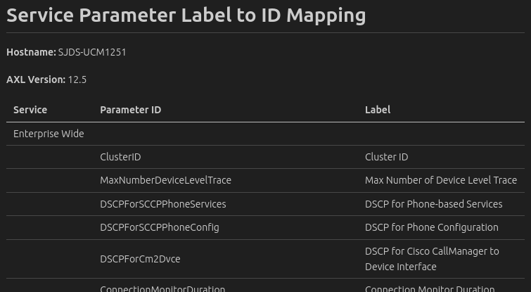

# cucm-service-param-name-mapper

## Overview

Sample script that scrapes Cisco Unified Communications Manager admin UI pages to map service parameter UI labels with their programmatic IDs.

Results are output to JSON and markdown formatted files.  Example JSON output files for CUCM versions [12.5(1)SU6](output_v12.51SU6.json)/ [14](output_v14.json) / [14SU3](output_v14SU3.json) are included.



Uses:

* [Beautiful Soup](https://www.crummy.com/software/BeautifulSoup/) for HTML screen scraping.
* [AXL SOAP](https://developer.cisco.com/site/axl/) to retrieve the CUCM process node UUID.

**Tested with:**

* Ubuntu 23.04
* Python 3.11.4
* CUCM 12.5(1)SU6 / 14 / 14SU3

DevNet sandboxes with CUCM instances are available for testing, e.g. **Collaboration / Collaboration 14.0**: [DevNet Sandboxes](https://developer.cisco.com/site/sandbox/)

## Pre-requisites

* Python 3.8+
* CUCM admin UI user credentials, with AXL read permissions

## Getting started

* Create/activate a Python virtual environment, e.g.:

  ```bash
  python3 -m venv venv
  source venv/bin/activate
  ```

* Install needed dependency packages:

  ```bash
  pip install -r requirements.txt
  ```

* Rename `.env_example` to `.env`, and edit to specify your CUCM host address and admin/AXL credentials.


  > **Notes:**
    > * CUCM hostname is case sensitive - use exactly what appears in CUCM admin **List / Server**.
    > * The CUCM admin user must have AXL read permission.

  Be sure to save the file!
  
* To run the sample, use the following command:

  ```bash
  python map_param_names.py
  ```
 
  or if editing the project in Visual Studio Code, just press **F5**

 ## Caveats

* This sample is likely to work against any fairly recent CUCM version - however, as it is implemented via scraping of HTML pages, cosmetic changes to the admin UI service parameter pages (which could happen for any major/minor/SU/ES version) may break parsing.
